# Microsoft Clarity UX Analysis: Heatmaps & Session Recordings

## Executive Summary
Why do users abandon a page before reaching key content, or click repeatedly on hero text that does nothing? Questions like these point to hidden friction that quietly undermines engagement and conversions.

Between April 25 and May 1, 2025, I analyzed user behavior on Microsoft Clarity’s public demo site. Using heatmaps and session recordings across desktop and mobile devices, I studied how real people navigated pages, where they paused, and why they droped-off.

I initially planned to study Nigerian user behavior and examine localized user experience (UX) needs. When local session counts were low, I shifted focus to a global view, adapting my analysis as product teams often do when data limitations arises.

My analysis revealed:
- Hero sections captured attention, but unclickable text elements confused users.
- Modals and calls to action engaged visitors, but unclear next steps could lead to drop-offs.
- Entire sections of some pages remain ignored, suggesting untapped space for value delivery.

For product managers and designers, these insights transform user behavior into practical ideas that improve clarity, reduce friction, and drive stronger business outcomes.

**_Disclaimer_**:
>**_All images of Microsoft Clarity shown in this repository are for educational and portfolio purposes only. The data is sourced from publicly available demo content. All rights to Clarity’s interface and branding belong to Microsoft._**

## Background

Even polished digital products can hide silent UX pain points, and Microsoft Clarity’s demo site is no exception. Clarity is a free analytics tool offering heatmaps and session recordings that reveal how users interact, where they hesitate, and what elements go unnoticed.

As an aspiring product manager and business data analyst, I treated this analysis like a live product discovery sprint. My initial goal was to study Nigerian user sessions to understand how localized design choices might impact usability. However, low session volume led me to expand the scope globally, highlighting how product teams often adapt when faced with data limitations.

This project deepened my understanding of Clarity as a tool and strengthened my analytical storytelling and problem-solving skills for user-centered product work.

> _This analysis was conducted in May 2025 as part of a product management and analytics project. Documentation and publication were finalized later. Analysis and insights are my own and do not represent Microsoft._

## Problem Statement

Despite its structured layout and visible CTAs, Microsoft Clarity’s homepage reveals signs of user confusion, low engagement in key areas, and visual elements that mislead interaction.
My original goal was to study Nigerian user behavior and examine localized UX needs. When the dataset proved too limited, I broadened the scope to ensure meaningful findings from a wider user base.

## Objectives & Scope

**Objective:** 

Identify user behavior patterns, drop-off points, and design pain points using Microsoft Clarity demo data, and provide actionable UX recommendations.

**Scope:**  

- Timeframe: April 25 to May 1, 2025
- Devices: Desktop and mobile
- Location: Global (after initial focus on Nigeria)
- Tools: Microsoft Clarity heatmaps and session recordings
- Focus: Homepage interactions only
- Filters tested: Nigeria, Chrome/Edge, various operating systems

## Methodology

Within the seven-day period from April 25 to May 1, 2025, I analyzed user behavior on Microsoft Clarity’s public demo site. The heatmap data included 35,879 page views and 45,221 clicks across 227 tracked elements. Session recordings totaled 35,809 results during the same timeframe. Initially, I filtered the data for Nigerian users, targeting Chrome, Edge, Android, iOS, Windows, and MacOS. But, this subset contained only 362 page views, 370 clicks across 41 elements, and 317 session recordings, which was insufficient for meaningful trend analysis. To ensure robust insights, I expanded the study to the full global dataset.

For heatmaps, I reviewed user interactions across key homepage sections, including navigation bars, hero banners, content blocks, modals, and the footer.I used Microsoft Clarity’s Area Insights to identify high and low engagement zones, dead clicks, and false affordances. Scroll depth analysis helped track how far users actually viewed and interacted with different sections of the page, highlighting areas that were visible but ignored. In session recordings, I examined five sessions (three desktop and two mobile), each lasting over one minute and containing at least five user interactions. I tracked rage clicks, navigation loops, hesitation, drop-off points, and scroll behavior, comparing patterns across device types.

This combined approach helped me turn quantitative click data into qualitative insights around user confusion, engagement gaps, and opportunities for UX improvement. 

## Key Findings & Insights
### Heatmap insights:

#### High engagement zones
- **Sign in:** 8,082 clicks (17.87%)
- **Sign in with Google:** 6,749 clicks (14.92%)
- **Sign in with Microsoft:** 3,165 clicks (7.00%)
- **Get started:** 2,584 clicks (5.71%)

Users heavily focused on the hero section and navigation bar, showing strong initial engagement with login options and CTAs.

 |Sign in CTA                  |  Modal sign up CTAs sidebar metrics | Get started CTA                 |
 |:---------------------------:|:-----------------------------------:|:-------------------------------:|
 |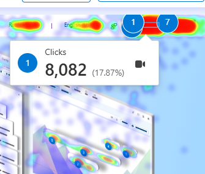 |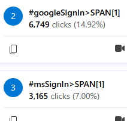 |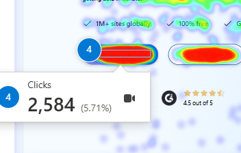|

*Figure 1: High interaction zones on hero and navigation bar*

#### Low engagement zones
- **Footer links and social media:** 1 click (virtually 0%)
- **Sidebar content and logos:** 1 click (virtually 0%)

Despite being visible, these areas were largely ignored, suggesting weak visual hierarchy, low perceived relevance, or scroll fatigue.

 |Sidebar items                  |   Footer links               | 
 |:-----------------------------:|:----------------------------:|
 |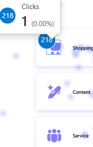|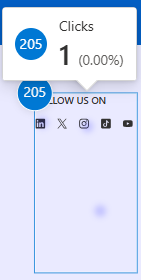|

*Figure 2: Low interaction zones on sidebar content and footer links*

### Scroll depth patterns
- Hero and navigation zone: 100% view rate
- Average fold zone: 89.73% view rate just above the product features, dropping to 75% immediately below
- Footer zone: only 66.83% of users scrolled this far

These insights highlight significant drop-off beyond the hero section, indicating that crucial CTAs or messaging placed lower on the page may remain unseen.

 |Hero/navigation zone                        |  Average fold zone                     | Footer zone                               |
 |:------------------------------------------:|:--------------------------------------:|:-----------------------------------------:|
 |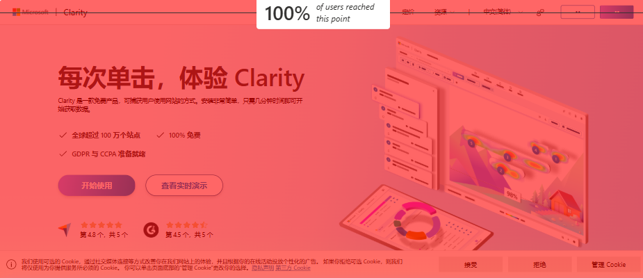|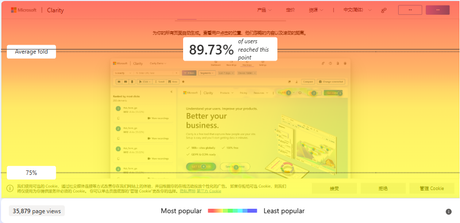|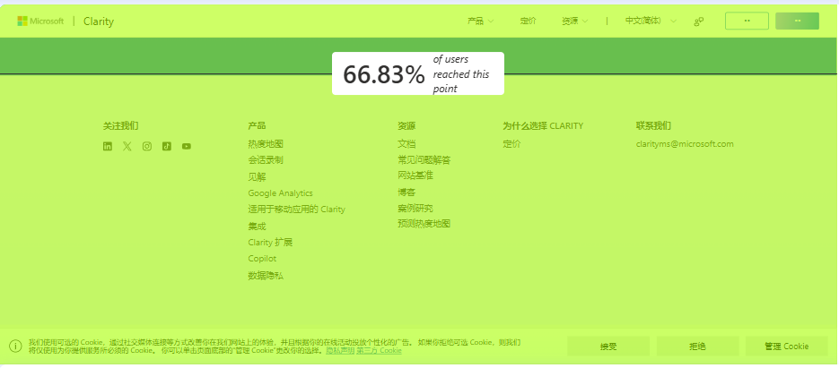|

*Figure 3: Scroll depth zones*

#### _Modal interaction insight_
_One modal automatically appeared during the filter customizations. Although not visible in heatmap screenshots, Clarity’s sidebar metrics revealed significant user engagement with these elements. For instance, “Sign in with Google” recorded thousands of clicks despite being absent from visual heatmaps. It remains unclear whether users manually closed the modal or if it disappeared automatically, suggesting potential inconsistencies in how modals are tracked during heatmap sessions._

#### Area insights overview
The Area insights feature helped visualize which page zones attracted the highest concentration of clicks.

 |High user engagement at the top of the page |Low engagement drop below the average fold  | 
 |:------------------------------------------:|:------------------------------------------:|
 |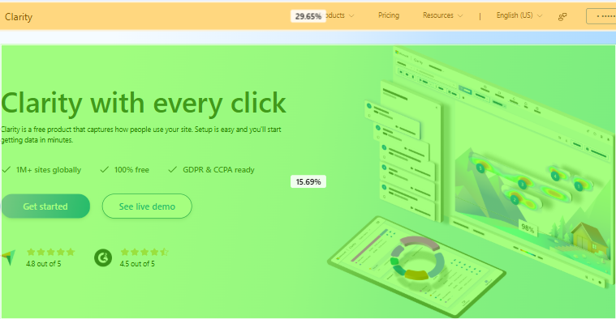             |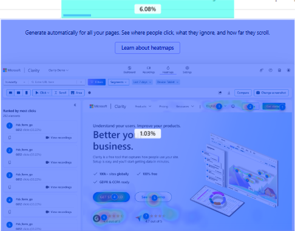|
 
*Figure 4: Area insights summarizes high and low engagement zones on the homepage*

Additional Area insights screenshots are stored in the repository for reference.

### Recommended "Explore Case Studies" CTA placement 
Heatmaps showed strong engagement in the hero section but significant drop-off below the fold. To maximize visibility, placing the “Explore Case Studies” call to action (CTA) directly beneath the hero section aligns with natural user focus zones. A secondary CTA midway down the page could capture deeper scrollers who miss the initial prompt.

### Session recording insights
- None of the five sampled users scrolled to the footer.
- Rage clicks and dead clicks occurred on static hero text and non-interactive visuals.
- Mobile users struggled more with sliding visuals and misinterpreted decorative images as clickable.

These patterns highlight mismatches between user expectations and UI affordance, leading to friction, confusion, and potential drop-offs.

## Detailed Analysis

### Desktop session nsights
- Focused mainly on hero and navigation sections.
- Hovered over non-clickable product blocks.
- Rage-clicked on static hero text, assuming it was interactive.
- Did not scroll beyond mid-page.

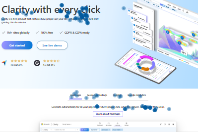

*Figure 5: PC users interaction insight*

### Mobile session insights
Across two mobile sessions, users displayed overlapping frustration behaviors:

- Repeatedly attempted to swipe sliding visuals, expecting interactive behavior.
- Missed CTAs placed lower on the page.
- Hesitated and backtracked within mid-page sections due to layout confusion.
- Paused on dense blocks of text and images, failing to locate clear calls-to-action, and ultimately abandoned sessions.

|User clicked on empty spaces| User attempted to swipe/click visuals | User paused on dense text blocks    | User backtracked between sections  |
|:--------------------------:| :------------------------------------:| :---------------------------------: | :---------------------------------:|
| 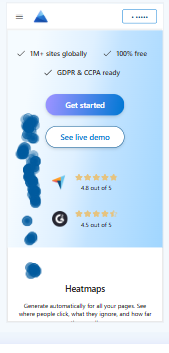 | 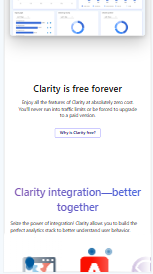            | 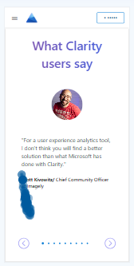          | 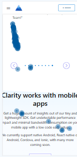         |

*Figure 6:  Mobile users behavior insight*

### Frustration behaviors

- **Dead clicks:** Users clicked static text or images believing they were interactive.
- **Rage clicks:** Rapid, repeated clicks driven by false affordances.
- **Hover traps:** Users hovered over text styled like links that weren’t clickable.
- No sessions observed users reaching the page footer.

|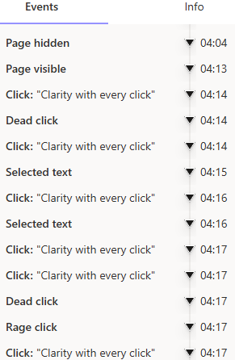|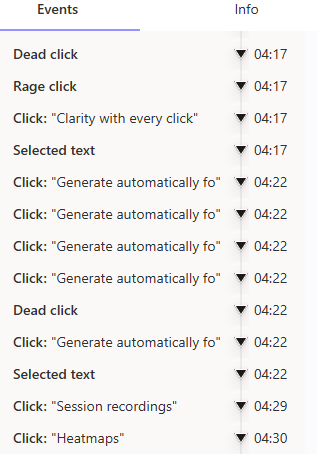|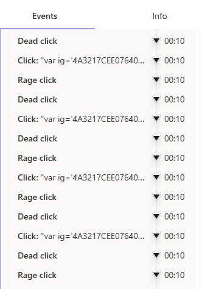| 

*Figure 7: Text selection, rage and dead clicks timestamps during  session replay*

## Hypothesis
If users mistake static content for interactive elements, it will likely cause frustration, increase dead clicks, and lead to early drop-off, particularly around the product feature section.

This hypothesis arose during session analysis, where users repeatedly clicked on non-interactive elements styled like CTAs or navigation items.

## Recommendations
Based on the analysis, I recommend these UX and product improvements:

- Use consistent visual cues (hover states, underlines, buttons) to signal clickable elements clearly.  
- Redesign or remove static elements that appear interactive, especially near the hero section and product features.  
- Simplify dense image and text blocks by breaking them into smaller, scannable sections.  
- Place the **“Explore Case Studies” CTA** directly beneath the hero section for higher visibility.  
- Add a secondary CTA after the product features section to engage users who scroll further down.  
- Replace sliding visuals on mobile devices with clear static images to reduce confusion and friction.  
- Consider implementing a subtle sticky CTA for mobile users or after the product features section to guide deeper scrollers.  
- Run an A/B test with these layout and design changes, measuring effects on click-through rates, scroll depth, and session duration.  
- Ensure key modals, such as login prompts, remain visible until users explicitly close them, to reduce confusion and improve onboarding.

These steps aim to increase clarity, reduce user frustration, and drive stronger engagement across both desktop and mobile experiences.

## A/B Test Proposal

**Objective:**  
Test whether clearer affordances and improved CTA placement reduce user confusion and improve engagement.

| Element            | Version A (Current)                  | Version B (Proposed)                         |
|--------------------|--------------------------------------|----------------------------------------------|
| Hero CTA           | Static heading                       | Styled as a clickable CTA button              |
| Mid-page CTA       | None                                 | Added below product features                 |
| Visuals (mobile)   | Sliding visuals                      | Replaced with static images                  |
| Content layout     | Dense blocks                         | Split into scannable sections                |
| Modal behavior     | May auto-close unexpectedly          | Remains visible until user dismisses         |

**Success metrics:**
- Higher click-through on CTAs
- Lower rage and dead clicks
- Increased scroll depth
- Longer session durations

## Visuals & Screenshot Integration
All visuals are stored in the `./images` folder and referenced throughout this case study using relative paths. Each image includes alt text for accessibility and short captions for clarity.

Key visuals embedded:
- Cover page banner
- Heatmaps (high and low engagement)
- Area Insights heatmap overview
- Scroll depth snapshots
- Session replay screenshots (text selection, rage clicks, dead clicks, hover behavior)
- Mobile user behavior insights
- PC user interaction insights

## Reflection & Learnings

Working with Microsoft Clarity gave me a sharper lens on how micro-interactions shape product success. I saw how subtle UI details can mislead users and why translating behavioral data into practical product decisions is crucial. This project strengthened my confidence in combining data insights, UX thinking, and user empathy to improve user journeys and product outcomes.

 ##Next Steps & Call to Action
I plan to share this case study on LinkedIn, Notion, and Medium. Moving forward, I’ll apply similar behavioral analysis techniques to live data, test design hypotheses through A/B experiments, and keep building a portfolio that bridges UX, data, and product strategy.

If you’re a recruiter, PM, or hiring manager who values product thinking, UX, customer empathy, and strong analytics, I’d love to connect and share ideas.

## Resources

- [View the full slide deck on Google Slides](./docs/Microsoft_Clarity_UX_Analysis_Report.pdf)
- [Browse all the raw analysis screenshots](./images/)

