# Where PLG Homepages Lose Users: A Microsoft Clarity Acquisition-Funnel Analysis

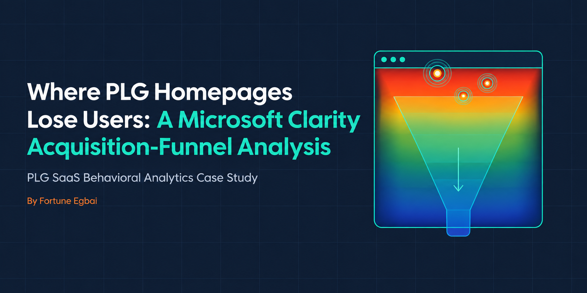

## Executive Summary
Microsoft Clarity's public demo homepage showed a steep engagement decay below the hero section, with clicks that fell from 29.65% in the hero and navigation zone to 6.08% at the average fold and under 1.2% in every zone beneath it, a decline consistent with general scroll-behavior research. What makes this decline especially costly is that the page's primary conversion actions concentrate almost entirely in the hero, and while a second signup button does sit near the footer, it draws just 0.11% of clicks, so attention lost below the hero is largely attention lost moving away from where conversion actually happens on this page. This analysis drew on heatmap and session-replay data across Clarity's demo environment, 35,879 page views, 45,221 clicks across 227 tracked elements, and 35,809 session recordings over a seven-day window, refined from an initial Nigeria-only filter that proved too small to sustain trend analysis. 
Two priority decisions follow, ranked by severity. The homepage should correct the false interactive signals running through the hero and product-feature zones on both desktop and mobile, where dead clicks, rage clicks, and mistaken swipe attempts concentrated in the site's highest-traffic areas, and reposition the underused "Explore Case Studies" CTA, which recorded 14 clicks against 45,221 total interactions, 0.03% of all activity. For a PLG SaaS product, this gap between attention and conversion opportunity has a direct, though directional, implication for signup and activation rates, since every visitor who disengages before encountering a working affordance or a visible secondary conversion path is a visitor the funnel loses earlier than it needs to.

## Problem Statement
The problem is not that visitors leave Microsoft Clarity's homepage. It is that many of them stay, try to engage, and fail, which is a meaningfully different problem to solve, since a bounce can mean simple disinterest, while the dead clicks and rage clicks on static hero and product-feature elements meant the page created an expectation it could not fulfill, right in its single highest-traffic zone, the same zone carrying the primary sign-in and "Get Started" calls to action.

The visitors affected are people evaluating whether to adopt Clarity as their own analytics tool, arriving with enough intent to land on the homepage but not yet committed to signing up. This friction sits at the acquisition stage of the PLG funnel and reaches into activation, since the same confusion recurs in the product-feature zone meant to demonstrate the product before anyone creates an account. In a market where Hotjar, PostHog, and FullStory offer comparably accessible heatmap and session-replay tools, a homepage that generates confusion rather than confidence is a conversion liability, since a prospect who hits friction here has no shortage of similar tools to try instead.

A resolved version of this problem would show up in two ways. Dead clicks, rage clicks, and mistaken swipe attempts across the hero and product-feature zones, on both desktop and mobile, would fall meaningfully, since visitors would stop encountering elements that promise interactivity they don't deliver. And the "Explore Case Studies" CTA would see its click-through rise clearly above the 0.03% it currently records, giving the page's secondary conversion path a real chance to work. Each of these is a metric this analysis can baseline now and a future test can move.

## Background
Microsoft Clarity is a free, product-led analytics platform that gives site owners and product teams heatmaps, session recordings, and scroll-depth data to see how visitors actually behave on their pages, placing it in the same PLG SaaS category as the homepage this analysis studied. That overlap makes the subject more useful than incidental, since a behavioral analytics tool's own marketing site works as a fair stand-in for PLG SaaS homepage design patterns generally, and gives this friction analysis a fitting subject, the exact kind of behavior Clarity itself is built to surface. This analysis was completed in May 2025 as part of a structured product management program, with documentation and publication finalized afterward.

Working through this dataset followed the same discipline a product team applies during a live discovery sprint, defining the question first, testing it against the data on hand, and adjusting scope the moment the data stopped supporting the original question. The original scope targeted Nigerian user sessions specifically, to test whether localized design choices affected usability for that market, but that subset returned only 362 page views, 370 clicks across 41 tracked elements, and 317 session recordings across the study window, too little to support reliable trend analysis. Expanding to the global dataset from there was a methodological adaptation, since product analysts make this call routinely when the data in hand can't yet answer the question and a broader dataset can.

## Disclaimer and Ethical Considerations
All images of Microsoft Clarity shown in this repository are used for educational and portfolio purposes only. The data is sourced from Microsoft Clarity's publicly available demo environment, and all rights to Clarity's interface and branding belongs to Microsoft. Brand assets are used for illustrative and analytical purposes only. The analysis, interpretations, and recommendations in this case study are my own and do not represent Microsoft or any affiliated entity. This project does not use or expose any real user personally identifiable information (PII).  

## Methodology
This analysis combined two complementary methods, heatmap area insights to see where clicks concentrated across many visitors, and session recordings to see how individual visitors actually moved through the page. Heatmaps are strong on breadth, showing which zones draw attention across tens of thousands of visits, but they cannot explain why a visitor clicked somewhere or what they were trying to do. Session recordings fill that gap by showing intent and hesitation in real time, at the cost of covering far fewer visitors. 

Heatmap review covered the full homepage, including the navigation bar, hero section, content blocks, sidebars, and footer, using Clarity's own Area Insights feature to quantify click concentration by zone and scroll depth to track how far visitors progressed before dropping off. That same review is what surfaced the dead clicks and false-affordance patterns running through this case study, clicks landing on elements that looked interactive but were not.

The data came from Microsoft Clarity's own publicly available demo environment, not from a live product this analysis managed or a specific company's user base, which shapes how far these findings can reasonably travel. The behavioral patterns here are real interactions from real visitors to Clarity's marketing site, which makes them valid evidence for general PLG SaaS homepage engagement and affordance patterns, but they say nothing about how a specific product's own user cohort would behave, since Clarity's demo traffic reflects whoever visited the site during the study window rather than a defined target user base.

Filtering originally targeted Nigerian sessions across Chrome, Edge, Android, iOS, Windows, and MacOS, the same subset referenced in Background that returned too little volume to sustain trend analysis. Expanding to the global dataset from there followed the same logic described earlier, since broadening scope when a filtered slice can't answer the question is what keeps an analysis honest instead of forcing conclusions from too little data.

Session recordings covered five sessions in total, three on desktop and two on mobile, each selected for running at least one minute and containing at least five interactions. Within those sessions, the analysis tracked rage clicks, navigation loops, hesitation, drop-off points, and scroll behavior, comparing patterns across device types.

 |Timeframe                  | Device                 | 
 |:-------------------------:|:----------------------:|
 |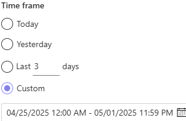|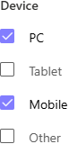|

 *Figure 1: Timeframe and device filter*

 Together, these methods support a precise account of this homepage during this seven-day window, covering which zones drew attention, which drew confusion, and where visitors stopped engaging. What they cannot do is establish causation or generalize beyond it, since heatmaps show where people click but not why, session recordings add texture while remaining observational, and five sessions, two of them on mobile, is not a sample large enough to support claims about how users behave in general. The findings here identify patterns worth testing further, not conclusions to act on without validation.

## Key Insights
**Attention concentration at the top, and what it says about who is actually on the page**

The four most-clicked elements on the page all sat in the hero section and navigation bar. Sign in drew 8,082 clicks, 17.87% of the total. Sign in with Google drew 6,749 clicks, 14.92%. Sign in with Microsoft drew 3,165 clicks, 7.00%. Get Started drew 2,584 clicks, 5.71%. Together these four accounted for over 45% of all 45,221 clicks recorded on the page, and Area Insights confirmed the same concentration at the zone level, with the navigation and hero zone holding 29.65% and 15.69% of total activity.

Sign-in clicks and "Get Started" clicks are not interchangeable signals. Someone clicking sign in almost certainly already has a Clarity account, while someone clicking "Get Started" is taking the specific action a new visitor takes to sign up. That distinction shows up clearly in the numbers. About 39.79% of all clicks came from what looks like returning-user traffic, while new-user acquisition, the action this homepage exists to drive, accounted for just 5.71%. A few clicks in either bucket may be misdirected, an existing user clicking "Get Started" out of habit, or a new visitor clicking "Sign in" before realizing they need an account first, but the overall pattern holds regardless of those occasional mismatches in intent.

Either way, "Get Started" sits as a clearly visible primary button in the hero section, its own heatmap hotspot large enough to place it among the page's four most-clicked elements. Its modest share of total clicks says less about whether visitors can find it and more about how many of them actually need it. That reinforces the read above: if a large share of this traffic already has an account, a highly visible "Get Started" button will still post a modest click count, simply because most of the audience walking past it doesn't need to click it. Confirming that split through a returning-versus-new visitor segmentation would tell Clarity's team whether "Get Started" is genuinely underperforming among the new visitors it's built for, or performing exactly as expected given who is actually on the page.

 |Sign in CTA                  |  Modal sign up CTAs sidebar metrics | Get started CTA                 |
 |:---------------------------:|:-----------------------------------:|:-------------------------------:|
 |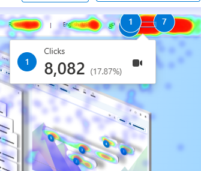 |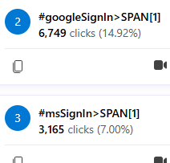 |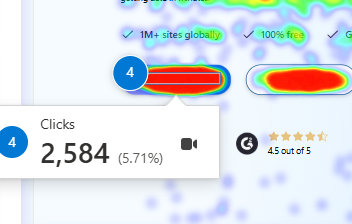|

*Figure 2: High interaction zones on hero and navigation bar*

**What scroll depth reveals that click share alone does not**

Scroll depth tracking showed 100% of visitors viewed the hero and navigation zone, 89.73% viewed the average fold zone just above the product features, dropping to 75% immediately below it, and 66.83% scrolled far enough to see the footer. Area Insights, measuring where clicks actually landed rather than where the page was simply visible, showed a much steeper decline: 29.65% and 15.69% of clicks in the hero and navigation zone, 6.08% and 1.03% at the average fold, 1.12% and 0.89% in the content zone, 0.11%, 0.20% in the footer, and 0.11%, 0.05%, 0.03% in the sidebar zones.

From the dataset, two-thirds of visitors scrolled far enough to see the footer, yet the footer captured close to none of the page's clicks, a signup button in a banner just above the footer links drew only 0.11%, a Blog link in the footer's Resources column drew 0.20%, and the social media icons row registered a single click on its own. That rules out simple scroll fatigue as the explanation, since most visitors were, in fact, still there. What the numbers show instead is that content below the hero failed to earn interaction even from visitors who saw it, which points to a relevance or design problem at that point in the page rather than a visibility problem alone.

The product features section sits inside the zone where click concentration drops from 6.08% to 1.03%, even though scroll depth data shows at least 75% of visitors still see that zone. Session recordings show the shortfall doesn't come from a missing element. The zone already holds a row of feature tabs, Heatmaps, Session Recordings, Insights, and Google Analytics, plus a "Learn about heatmaps" button, and the same session recordings show visitors clicking on on the tabs and on the descriptive text around the button, though not on the button itself. What's missing is a path back to conversion. None of the page's actual conversion actions sit in this stretch of the page. Sign in, Get Started, and the sign-in options all live in the hero above it, and the page's one other conversion action, a signup button near the footer, sits even further down, so a visitor who engages with the feature tabs here has nowhere to act on that interest without leaving this zone entirely. A visitor clicking through these tabs is doing exactly what activation depends on, exploring what the product actually does, and giving that visitor a way to sign up right there, rather than sending them back to the hero to find one, would let the page capture that interest at the moment it's strongest.

 |Navigation/hero area           |Average fold area              |
 |:-----------------------------:|:-----------------------------:|
 |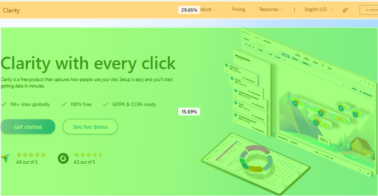|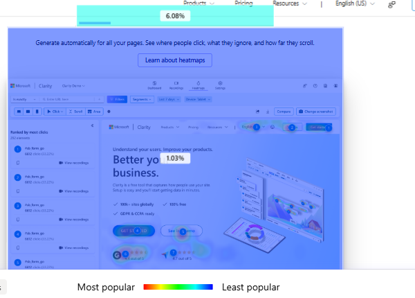|
 

 |Content Area                    | Footer Area                         | Sidebar Area                 |
 |:------------------------------:|:-----------------------------------:|:-----------------------------:|
 |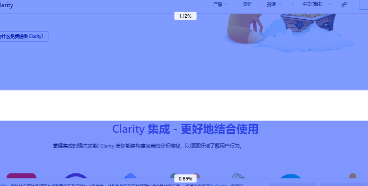 |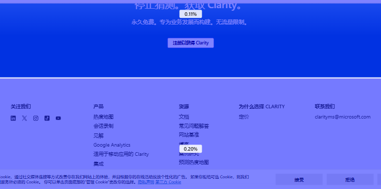       |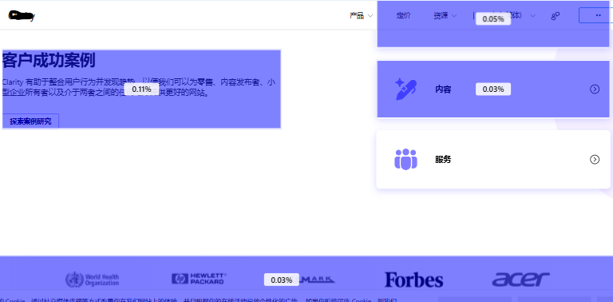|
 
*Figure 3: Area Insights heatmap gradients for the high and low engagement zone, with a popularity color scale.*

 |Navigation/hero zone                        |  Average fold zone                     | Footer zone                               |
 |:------------------------------------------:|:--------------------------------------:|:-----------------------------------------:|
 |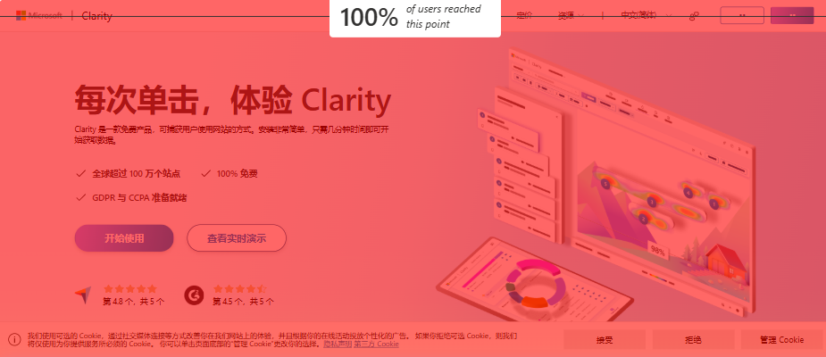|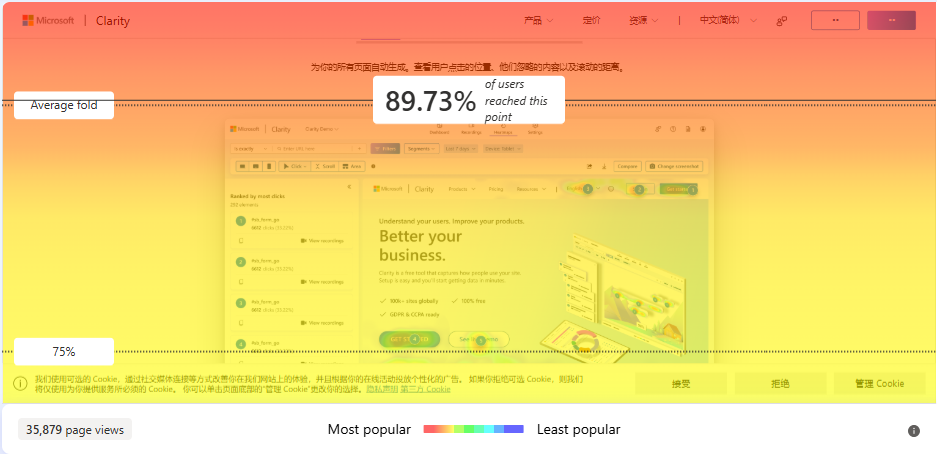|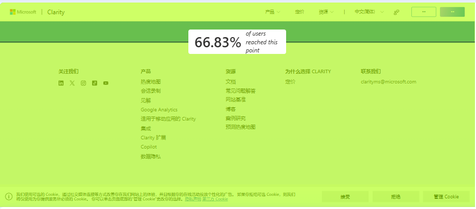|

*Figure 4: Scroll depth zones: navigation and hero, average fold, and footer zones*

**Elements that look interactive but are not, driving measurable frustration**

Clarity's session replay data captured timestamps showing dead clicks, rage clicks, and text selection events across multiple interaction sequences, concentrated on static hero text and product-feature visuals, the same elements sitting inside the page's highest-traffic zone, with desktop sessions in particular showing repeated rage clicks on hero text that never responded. Mobile sessions showed the same underlying problem rather than a different one. Visitors clicked on empty space beside the hero buttons, paused on dense testimonial text, and backtracked between sections, the same kind of hesitation and misread static content desktop sessions produced. Mobile added one behavior desktop never showed, repeated attempts to swipe or tap the sliding visuals, treating it as an interactive carousel. Three of the five sampled sessions overall, spanning both devices, showed this kind of visible hesitation or back-and-forth navigation.

This traces back to styling, not to anything visitors did wrong on either device. Bold hero text and image blocks positioned like buttons signal interactivity they do not deliver, so clicking is the reasonable response to what the page looks like, not a misunderstanding on the visitor's part. On mobile, the sliding visual adds a second version of the same problem, a gesture cue with nothing behind it, and a touch interface makes that mismatch land harder, since a visitor's hand is already positioned to act when the swipe produces nothing. When a click or a swipe gets no response, a visitor does not conclude the element was decorative. A more natural read is that something about the product is not working.

The product features section sits inside the zone where click concentration drops from 6.08% to 1.03%, even though scroll depth data shows at least 75% of visitors still see that zone. Session recordings show the shortfall doesn't come from a missing element. The zone already holds a row of feature tabs, Heatmaps, Session Recordings, Insights, and Google Analytics, plus a "Learn about heatmaps" button, and the same session recordings show visitors clicking on the tabs and on the descriptive text around the button, though not on the button itself. What's missing is a path back to conversion. None of the page's actual conversion actions sit in this stretch of the page. Sign in, Get Started, and the sign-in options all live in the hero above it, and the page's one other conversion action, a signup button near the footer, sits even further down, so a visitor who engages with the feature tabs here has nowhere to act on that interest without leaving this zone entirely. A visitor clicking on these tabs is trying to do exactly what activation depends on, exploring what the product actually does, and giving that visitor a way to sign up right there, rather than sending them back to the hero to find one, would let the page capture that interest at it's strongest moment.

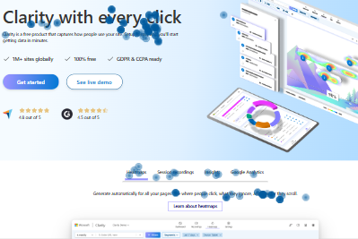 

*Figure 5: Desktop users interaction pattern*

|User clicked on empty spaces| User attempted to swipe/click visuals | User paused on dense text blocks    | User backtracked between sections |
|:--------------------------:| :------------------------------------:| :---------------------------------: | :---------------------------------:|
| 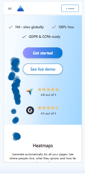 | 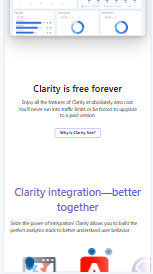            | 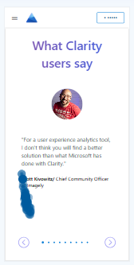          | 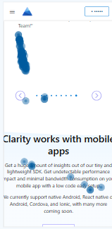      |

*Figure 6: Mobile users interaction pattern*

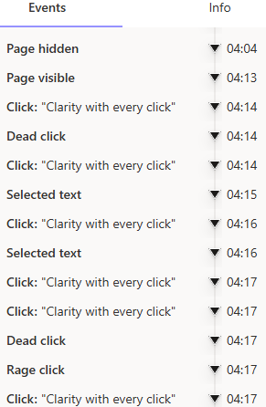  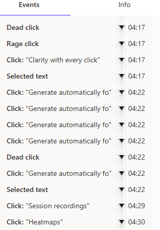  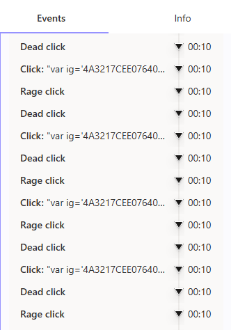 

*Figure 7: Text selection, rage and dead clicks timestamps during session replay*

**The page's lowest-attention zones, and a CTA caught in the same pattern**

The page's lowest-attention zones extend the same pattern established above. Sidebar items recorded a single click, effectively 0% of total activity, matching the footer's social icons at that same near-zero level, while Area Insights put the sidebar zone's overall share at 0.11%, 0.05%, and 0.03%. The "Explore Case Studies" CTA, a separate element positioned elsewhere on the page and distinct from the "Case Studies" link in the footer's Resources column, recorded 14 clicks out of 45,221 total interactions, 0.03% of all activity.

The "Explore Case Studies" CTA and the sidebar both sit below the average fold, in the content and sidebar zones where Area Insights already showed engagement falling to a fraction of a percent, 1.12% and 0.89% in the content zone, 0.11%, 0.05%, and 0.03% in the sidebar. Both occupy the same lower stretch of the page, and both show the same outcome the false-affordance pattern revealed higher up, interaction that fails to happen, here most plausibly because a position this far down the page and unremarkable styling give a visitor no particular reason to stop and click.

A call to action sitting in a zone that gets this little visual priority cannot prove whether it works, regardless of how many visitors technically scroll past it. Moving "Explore Case Studies" closer to the hero, where attention and click share both concentrate, gives the element an actual test of its value rather than leaving it to compete for interaction it currently has no realistic chance of winning.

 |Sidebar items                   | Footer links                 | Explore Case Studies CTA    |
 |:------------------------------:|:----------------------------:|:---------------------------:|
 |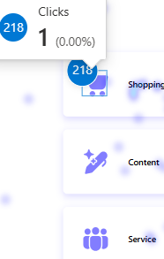|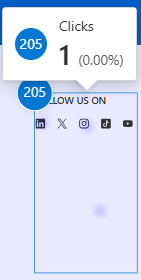|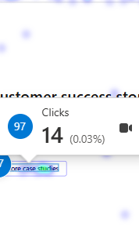|

*Figure 8: Low interaction zones on sidebar,footer links, and Explore Case Studies CTA*

**An unresolved question in how the sign-in modal is tracked**

One modal appeared automatically during filter customization. Although not visible in heatmap screenshots, Clarity's sidebar metrics showed significant engagement with elements inside it, Sign in with Google recorded 6,749 clicks, 14.92%, and Sign in with Microsoft recorded 3,165 clicks, 7.00%, despite not being visible in the standard heatmap view. 

It remains unclear from the available data whether users manually dismissed the modal or whether it closed automatically. A plausible explanation is that heatmap capture reflects the page in its default state, so a click inside a dynamically rendered overlay can register in the click data without the overlay ever appearing in the visual heatmap. That would account for the mismatch just as well as a visitor closing the modal before capture would, and nothing here confirms which one actually happened.

The click counts themselves aren't in question, Clarity's sidebar metrics recorded them plainly. What's unresolved is what those clicks actually represent, whether they reflect a visitor completing a visible sign-in interaction or a click registering against an overlay that never rendered the way the count implies. Instrumenting explicit modal open and close events, rather than relying on heatmap visibility alone, would remove that ambiguity directly, so a click count and a visible interaction agree instead of contradicting each other.

### Findings and Severity

The table below rates every finding in this section on a four-level scale. Critical marks a finding that blocks a core action such as sign-in or the primary CTA, High marks one affecting the page's highest-traffic zone, Medium marks one affecting a secondary zone, and Low marks a cosmetic or edge-case issue. Traffic here means share of clicks from Area Insights, which makes the hero and navigation zone the highest-traffic zone on the page. No finding reaches Critical, since sign-in and "Get Started" both drew substantial clicks and nothing on the page blocked them. Severity measures how much a finding hurts visitors, while priority reflects the decision it feeds, so a Medium finding can sit under a High-priority decision.

| Page Zone or Element | Observation | Root Cause | Severity | Recommended Decision | Priority |
|---|---|---|---|---|---|
| Hero and product-feature zones, both devices | Dead clicks, rage clicks, and text selection appeared across all five sessions, including repeated rage clicks on static hero text on desktop and clicks on empty space beside the hero buttons on mobile | Styling signals interactivity these elements do not deliver | High | Decision 1, reserve button styling and hover states for elements that respond | High |
| Product-features zone | Clicks landed on the feature tabs and on the text around "Learn about heatmaps" rather than the button itself, and click share fell from 6.08% to 1.03% while at least 75% of visitors still saw the zone | No conversion action sits in this zone, and the "Learn about heatmaps" button did not draw the clicks aimed near it | Medium | Decision 1, make each tab open that feature's view in the live demo, with a signup CTA alongside it | High |
| Sliding visual, the mid-page, mobile | Repeated swipe and tap attempts in both sampled mobile sessions | A gesture cue with nothing behind it | Medium | Decision 1, replace with a static image on mobile | High |
| Sections just below the product features, both devices | Hesitation and back-and-forth navigation in three of five sessions, and on mobile, pauses on dense testimonial text and sessions that ended without reaching the footer's signup CTA | Dense text and image blocks just below the product features, per session observations | Medium | Break these blocks into shorter, scannable sections as a follow-up test after Decision 1 | Low |
| "Explore Case Studies" CTA | 14 clicks, 0.03% of all activity, ranked 97th of 227 tracked elements | Most plausibly, a position far down the page and unremarkable styling | Medium | Decision 2, move directly beneath the hero | Medium |
| Content and sidebar zones | The content zone drew 1.12% and 0.89% of clicks, the sidebar 0.11%, 0.05%, and 0.03%, and sidebar items one click | Most plausibly, the same low position and unremarkable styling | Medium | No separate action, this low engagement is the reason Decision 2 moves the CTA out of this area | Low |
| Footer | 66.83% of all visitors reached it, though none of the five sampled sessions did, yet its signup button drew 0.11%, the Blog link 0.20%, and the social icons one click | A relevance or design problem rather than a visibility one | Medium | No separate action, monitor after Decisions 1 and 2 ship | Low |
| Sign-in options versus "Get Started" | Sign-in options drew 39.79% of clicks and "Get Started" drew 5.71% | The two actions serve different intents, and close to 40% of clicks look like returning-user traffic | Not rated, interpretation finding | Segment new and returning visitors before judging "Get Started" performance | Not ranked |
| Sign-in modal, Google and Microsoft options | Sidebar metrics recorded 6,749 and 3,165 clicks on modal elements absent from the visual heatmap | Unresolved, visitors may have closed the modal or it may have closed on its own | Not rated, data-integrity item | Instrument modal open and close events first, and keep the modal open until visitors close it only if auto-dismissal is confirmed, as covered in Study Constraints and Next Steps | Not ranked |

## Product Decisions and Recommendations

Both decisions below answer one pattern that ran through the page. Visitors either tried to act on elements that gave them nothing back, or reached content and moved past it without acting because the actions worth taking sat somewhere they were not looking. The sign-in modal tracking question from Key Insights is deliberately left unranked here, since its behavioral meaning is still unresolved, and it appears instead as a next step in Study Constraints and Next Steps.

**Decision 1. Correct the misleading interactive signals on desktop and mobile**

- **Decision.** The homepage should reserve interactive styling, such as hover states, underlines, and button treatments, for elements that actually respond, and restyle static hero text and product-feature blocks so they no longer read as clickable. Where visitors clearly try to act, the page should respond rather than discourage them, so each feature tab should open that feature's view in Clarity's public demo environment, with a signup CTA shown alongside it rather than in front of it. On mobile, the mid-page sliding visual should be replaced with a static image.
- **Rationale.** Dead clicks, rage clicks, and text selection appeared across all five sessions, concentrated on static hero text in the zone holding the largest share of the page's clicks, 29.65% and 15.69% across the hero and navigation area, and on product-feature visuals further down the page. Restyling beats removing these elements outright, because the hero text and product visuals carry the page's value proposition, and deleting them would trade a signaling problem for a content one. The feature tabs call for the opposite treatment, since visitors already click on them, and sending those clicks straight to the feature itself gives that interest the shortest path to the product. Opening the demo without a signup wall keeps faith with the "100% free" promise in Clarity's own hero, which a gate in front of that first look would undercut. On mobile, a static image is a stronger choice than keeping the slider with clearer swipe cues, because it removes the ambiguity entirely rather than asking visitors to learn how the slider works.
- **Expected impact.** No test has run yet, so this is a directional estimate rather than a measured result. Dead clicks, rage clicks, and swipe attempts should fall Dead clicks, rage clicks, and swipe attempts should fall, and more of the clicks already landing on the feature tabs should carry into the demo and on to signup. As one external reference, Nielsen Norman Group's 2017 eyetracking study of 71 users found that participants spent 22% more time on pages with weak signifiers and made 25% more fixations. That study examined interactive elements that failed to look interactive, the reverse of this page's problem, but it supports the same principle that unclear signals about what responds slow visitors down and cost them confidence. Supporting this strategy, Navattic’s State of the Interactive Product Demo Report, compiled from macro customer data rather than internal project metrics, found that 66% of top-performing product tours are completely ungated. Furthermore, removing form gates drives an average 6% lift in user engagement and a 7% increase in demo completions.
- **Trade-offs.** Restyling the hero gives up some of the visual boldness the current design uses for impact. The static image loses the slider's ability to show several views in one space. Routing tab clicks into the demo moves visitors off the homepage and away from its own conversion actions, so the signup CTA inside each demo view has to carry that conversion on its own. The full change also requires design and engineering work across both desktop and mobile layouts, plus linking each tab to a matching demo view.
- **Priority.** High, because it affects the page's highest-traffic zone on both devices this analysis covered.

**Decision 2. Move "Explore Case Studies" to directly beneath the hero**

- **Decision.** The homepage should move the "Explore Case Studies" CTA from its current position below the average fold to directly beneath the hero section, where attention and click share are concentrated.
- **Rationale.** The CTA recorded 14 clicks, 0.03% of all activity, and ranked 97th of 227 tracked elements. It currently sits in the same lower territory as the content and sidebar zones, where engagement fell to 1.12% and 0.89% in content and as low as 0.03% in the sidebar. A sticky CTA on mobile was considered and set aside as a first move, because it would add a persistent element competing with the hero's own conversion actions before anyone knows whether case studies earn clicks at all. Removing the CTA was also set aside, because at this position the data cannot yet separate visitors who don't want case studies from visitors who never gave them a real look. Moving it is the most direct way to find out.
- **Expected impact.** As with Decision 1, this is a directional estimate until tested. Clicks on "Explore Case Studies" should rise once the CTA sits in the page's main attention zone. As an external reference, Nielsen Norman Group's 2018 scrolling and attention study found that users spent about 57% of their page-viewing time above the fold and 74% within the first two screenfuls, which is where this move would place the CTA.
- **Trade-offs.** The space beneath the hero is the page's most contested high-impact zone. Placing case studies there puts them in competition with "Get Started" and "See live demo" for attention, and it could pull some new visitors toward reading instead of signing up. That risk is the reason this change should be tested rather than shipped outright.
- **Priority.** Medium, because it serves a secondary conversion path rather than the page's primary signup actions.

### Decision Matrix

The matrix below compares the two decisions side by side. Effort is a relative estimate between them, since neither has an engineering estimate behind it. Confidence follows the three tiers of Intercom's RICE framework, where high confidence requires measured reach, research on impact, and an engineering estimate of effort, which is why neither decision rates higher than Medium before testing.

| Decision | Expected Impact | Effort | Confidence Level | Key Trade-off |
|---|---|---|---|---|
| 1. Correct the misleading interactive signals on desktop and mobile | Fewer dead clicks, rage clicks, and swipe attempts, and more feature-tab clicks carried into the demo and on to signup (directional) | Medium compared with Decision 2, because it touches several elements on both desktop and mobile and also means linking each tab to its demo view | Medium, because the click data is large-sample and the problem shows in both data sources, while the session evidence covers only five sessions and the effect of these changes is still untested | Gives up some of the hero's visual boldness and the slider's multi-view space, and sending tab clicks into the demo moves visitors away from the homepage's own conversion actions |
| 2. Move "Explore Case Studies" directly beneath the hero | More clicks on "Explore Case Studies" above its 0.03% baseline (directional) |Low compared with Decision 1, because it moves one element that already exists | Medium, because the low click share comes from large-sample data and external attention research supports the move, while whether visitors want case studies at all is still untested | Competes with "Get Started" and "See live demo" in the page's most contested space |

## Metrics and Experimentation Plan

Every percentage attached to a page element earlier in this case study is a share of all recorded clicks. A share like that can rise or fall when other elements gain or lose clicks, even when nothing about the element itself has changed, so the click metrics below use clicks per page view instead, calculated from the same documented counts. Where this dataset has no baseline for a metric, the table says so, and that baseline would be measured before any change goes live rather than guessed now.

### Metrics Dashboard

| KPI | Definition | Baseline | Target | Measurement Method |
|---|---|---|---|---|
| Dead and rage clicks on non-responsive elements, by device | Dead and rage clicks or taps landing on static hero text, product-feature visuals, and the mobile mid-page area where the slider sat, per 1,000 page views, split into desktop and mobile | Seen across all five sampled sessions but not documented numerically, measured over the two weeks before launch | A fall after launch (directional) | Clarity's dead-click and rage-click tracking, filtered by zone and device |
| "Explore Case Studies" clicks per page view | Clicks on the CTA divided by homepage page views | About 0.04%, from 14 clicks across 35,879 page views, equal to 0.03% of all clicks | At least double, to about 0.08%, the Test 1 threshold | A/B testing platform, cross-checked against Clarity click counts |
| "Get Started" clicks per page view, guardrail | Clicks on "Get Started" divided by homepage page views | About 7.2%, from 2,584 clicks across 35,879 page views, equal to 5.71% of all clicks | No statistically significant drop during Test 1 | A/B testing platform, cross-checked against Clarity click counts |
| Signup starts per homepage visitor | Homepage visitors who start signing up during the same session, whether from the homepage or a demo view, divided by all homepage visitors | Not documented, measured in a pre-test period | At least a 10% relative lift, the Test 2 threshold | A/B testing platform with signup-start event tracking |

The restyling and the slider replacement from Decision 1 would ship straight away rather than wait for a test. They correct clear usability failures rather than bet on new behavior, and current experimentation guidance, including Mixpanel's among it, holds that a clear usability failure does not need an experiment to prove it should be corrected. Both changes can also be rolled back if the numbers move the wrong way, which keeps the risk of shipping them without a test low. These two changes would go live before either test begins, and the first KPI above would compare the two weeks before launch with the two weeks after. That before-and-after comparison is weaker than a controlled test, since outside factors can move the same numbers, which is why nothing else on the page should change during that window

Both tests follow the standard most experimentation teams use, 95% confidence and 80% statistical power, with the smallest lift worth acting on fixed before the test starts and never adjusted mid-test. Nielsen Norman Group's A/B testing guidance adds that a test should run at least one to two weeks even when traffic is plentiful, to account for normal swings in user behavior. For Test 1, that standard shapes the threshold directly. At a baseline of about 0.04% clicks per page view, detecting a 20% relative lift would take roughly 1.1 million page views per variant, and a 50% lift roughly 201,000. A doubling needs about 60,000 per variant, roughly three and a half weeks at the traffic this dataset recorded. Given how much of visitors' attention stays within the first two screens of the page, as the research cited in Decision 2 found, moving a CTA that ranked 97th of 227 tracked elements into the page's main attention zone is the kind of change that can plausibly double its clicks, so a doubling is both detectable and worth acting on.

### Experiment Plan

| Test Name | Hypothesis | Control | Variant | Primary Metric | Success Threshold |
|---|---|---|---|---|---|
| Test 1. "Explore Case Studies" beneath the hero |Moving the CTA from below the average fold to directly beneath the hero will at least double its clicks per page view without lowering "Get Started" clicks, because it will sit in the page's main attention zone| Current page, with the CTA below the average fold | The same page, with the CTA directly beneath the hero and nothing else changed | "Explore Case Studies" clicks per page view, with "Get Started" clicks per page view as the guardrail | At least a doubling from about 0.04%, at 95% confidence and 80% power, with no significant drop in "Get Started," after at least two full weeks and about 60,000 page views per variant |
| Test 2. Feature tabs open demo views | Letting each feature tab open that feature's view in Clarity's public demo environment, with a signup CTA alongside it, will raise signup starts per homepage visitor, because visitors who show interest in a feature will see it straight away with a path to sign up | Current tab behavior | Each tab opens that feature's demo view, with a signup CTA shown alongside it rather than in front of it |Signup starts per homepage visitor, with the share of tab-clicking visitors who go on to start signing up as a secondary metric | At least a 10% relative lift, the smallest gain worth the engineering effort, at 95% confidence and 80% power, over at least two full weeks, with sample size calculated from a pre-test baseline |

A positive result in Test 1 would support shipping the new placement, as long as "Get Started" holds steady. If "Explore Case Studies" gains clicks while "Get Started" drops significantly, the page would be trading signup intent for case-study reading, and the placement should not ship in that form. A null result would mean something different, that even in the page's main attention zone the CTA did not draw twice the interest, which suggests the offer or its wording limits clicks more than its position does. Because the test is sized to detect a doubling, a real but smaller lift could still go undetected, so a null result makes a large effect unlikely rather than ruling out every effect. A positive result in Test 2 would support rolling the tab change out to every visitor. A null result there would suggest that earlier access to the product does not move signups on its own, and the team would review the demo views themselves before trying again.

## Business Impact
For a PLG SaaS product, the homepage's first job is to turn anonymous visitors into free signups, and both decisions in this case study work at that acquisition stage. Dead clicks, rage clicks, and text selection appeared across all five sampled sessions, on desktop and mobile alike, concentrated on hero text and product visuals. Correcting those signals would stop visitors from would stop visitors from wasting clicks on elements that give nothing back, and letting a click on a feature tab open that feature in Clarity's public demo environment would give their curiosity somewhere to go, with a signup option beside it. Moving "Explore Case Studies" up beneath the hero would do similar work for visitors who want proof before they commit. Case studies are one of the page's forms of social proof, alongside its ratings and testimonials, and with 14 clicks across a full week, almost no one was acting on them.

The effects beyond signup are harder to claim.Activation happens after someone creates an account, a stage this study never observed, though a visitor who has already explored a feature in the demo would plausibly reach signup with a clearer sense of what they are getting. Retention sits largely outside these decisions. Close to 40% of clicks came from what looks like returning users on their way to sign in, and neither decision touches that path.

The business value works differently here, because Clarity has no paid tier. Its own pricing page explains that Microsoft uses anonymous behavioral data to improve the machine learning models behind many of its products, and that Clarity is one of the ways it gathers that data. For Clarity, the return is every new user who signs up and installs it on a site. This dataset holds no signup or installation figures, so that return can't be put into numbers here, and the impact stays directional. On a PLG SaaS product that does charge, the same homepage losses would cost more directly, because every visitor lost before signup is one fewer free or trial user who could later upgrade to paid

Competition makes all of this more pressing. As of 2026, PostHog's free tier includes 5,000 session replays and 1 million events a month, Hotjar offers a free plan under Contentsquare's pricing, and FullStory offers limited free access, so a prospect who leaves Clarity's homepage unconvinced can try an alternative at no cost. The "100% free" promise in Clarity's own hero only helps if visitors stay long enough to take it up. There is also a credibility cost particular to this product. A visitor evaluating a behavior analytics tool is, at least in part, judging how well its makers understand user behavior, and a homepage that produces the very dead and rage clicks the product is built to detect gives that visitor an early reason to doubt it.

## Study Constraints and Next Steps
Three constraints set out in Methodology shape how far these findings reach. The session evidence rests on five sessions, two of them on mobile, the data comes from Clarity's public demo environment rather than a defined user cohort, and the analysis draws on the full global dataset. Two more follow from how the analysis itself was done. The ratings in the Findings and Severity table reflect a single analyst's judgment, and Jakob Nielsen's guidance on severity ratings recommends averaging several independent evaluators, so those ratings are best read as a reasoned first pass rather than a settled ranking. And because the study moved to global data, it says nothing about Nigerian visitors specifically, which leaves the localized question it originally set out to answer still open, worth returning to once enough Nigerian sessions exist to support it.

Four next steps would close the questions this analysis leaves open. The first would instrument the sign-in modal's open and close events, so each recorded click can be matched to a modal that visibly appeared, and would keep the modal open until visitors close it only if that data shows it was closing on its own. The second is a follow-up test on the dense text and image blocks just below the product features, run after Decision 1 ships, measuring how many visitors scroll past those sections, with its threshold set once the new page gives a baseline. The third would split homepage traffic into new and returning visitors before anyone judges "Get Started," since close to 40% of clicks appear to come from people who already have an account. The fourth would strengthen the behavioral evidence itself, replacing the five selected sessions with a larger random sample split by device, and adding a second analyst to rate severity independently.

*Questions or feedback on this analysis are welcome via [LinkedIn](https://www.linkedin.com/in/fortuneegbai/).*

## Resources
- [Browse all the raw analysis screenshots](./images/)

